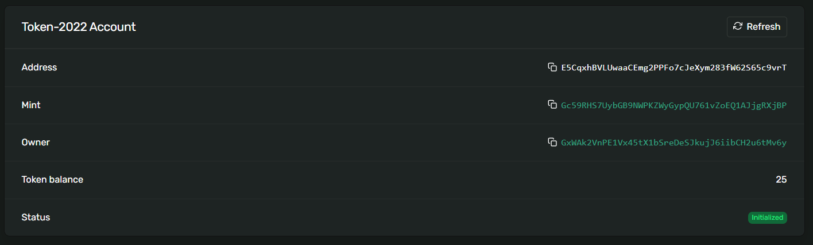

# Solana Token Vault - Devnet Demo

## Overview
This repo demonstrates creating a programmable token vault on Solana devnet, and locking tokens using an Anchor smart contract.

- Program: Anchor-based vault contract (see /programs/token-vault)
- Script: TypeScript/AnchorJS for devnet interaction (see /app/send-tokens.ts)
- Network Solana Devnet
---
# Demo Proof
- Vault PDA:E5CqxhBVLUwaaCEmg2PPFo7cJeXym283fW62S65c9vrT(https://explorer.solana.com/address/E5CqxhBVLUwaaCEmg2PPFo7cJeXym283fW62S65c9vrT?cluster=devnet)



- Program Deployed:3Qy5Qdhxx3c7xCmB1tyUF2swceQkMit5X62yzzeP5xRBM4ZrL3Cy5v9tk3Gm1cvmCkcnhwyLG4jvbDGbqTnxujTD(https://explorer.solana.com/tx/3Qy5Qdhxx3c7xCmB1tyUF2swceQkMit5X62yzzeP5xRBM4ZrL3Cy5v9tk3Gm1cvmCkcnhwyLG4jvbDGbqTnxujTD?cluster=devnet)
- Initialized Vault: 5JKpitPxigMAtV4GnngH2EASuHBxu33tocXXmdQ2DwwPyGAQUMEYvbvv1pwmjf15iFQT2XcGC5VYeurz9fxoHspK(https://explorer.solana.com/tx/5JKpitPxigMAtV4GnngH2EASuHBxu33tocXXmdQ2DwwPyGAQUMEYvbvv1pwmjf15iFQT2XcGC5VYeurz9fxoHspK?cluster=devnet)
- Deposit: 3s4p2nD8GMfAkcof1mQL9Rd6hP5ycwtwG51NoqraMEjUaAQvZMeKtmXs5TAMmGb1wHURTqXwpLCWzkBvHiQnkTKb(https://explorer.solana.com/tx/3s4p2nD8GMfAkcof1mQL9Rd6hP5ycwtwG51NoqraMEjUaAQvZMeKtmXs5TAMmGb1wHURTqXwpLCWzkBvHiQnkTKb?cluster=devnet)
- Mint: Gc59RHS7UybGB9NWPKZWyGypQU761vZoEQ1AJjgRXjBP(https://explorer.solana.com/address/Gc59RHS7UybGB9NWPKZWyGypQU761vZoEQ1AJjgRXjBP?cluster=devnet)

---
# Step 1: Deploy the Vault Program
```bash
anchor build
anchor deploy --provider.cluster devnet
```

*Make sure you have devnet SOL in your deployment wallet. You can get it with:*
```bash
solana airdrop 2 --url https://api.devnet.solana.com <YOUR_PUBLIC_KEY>
```
---
# Step 2: Run the Vault Script to Lock Tokens
Edit /app/send-tokens.ts as needed, then execute:
```bash
export ANCHOR_WALLET=path/to/your/wallet/id.json
export ANCHOR_PROVIDER_URL=https://api.devnet.solana.com

yarn ts-node -T ./app/send-tokens.ts
```
- This will
    - Initialize the vault(If not already present)
    - Deposit/lock tokens in vault from your funded user wallet address

---
# Example Output
```text
StatePDA: 5ECqxBhVNLUwaaCEMg2PF0JCeHJw3anB6X626S6YtvQf
VaultPDA: E5y4PxbhNLUwaaCEMg2PF0JCeHJw3anB6X626S6YtvQf
User ATA: AK6bPNvaEPiV4tsKbDrseUxjjJoidbCMHEvxe4i1b1iP
Vault not found, creating ...
Initializing Vault!...
Initialized vault: 5JJXpitXpigMAtv4agnHd2EASuHbBxu3t30C2DwwPyGAQUMEYbvv1pwmjf15iFQT2XcGC5VYeurz9fxoHsPK
Depositing tokens...
Deposit tx: 34p2pndcmAMfakofiLmQGRd6hP5yctwg15Uq6ZhTAAQvZMeKtmXs5TAMmGb1wHURTqXwpLCWZkBvHiQnkTKb
Target amount: 10000000000
Token Mint: Gc59RHS7UybGB9NWPKZWyGypQU761vZoEQ1AJjgRXjBP
Vault executed!
```
---
# Notes
- This vault logic uses Token-2022; be sure your mint and token operations use the same program.
- If you want to run on localnet first for safety, update URLs and configurations accordingly.
